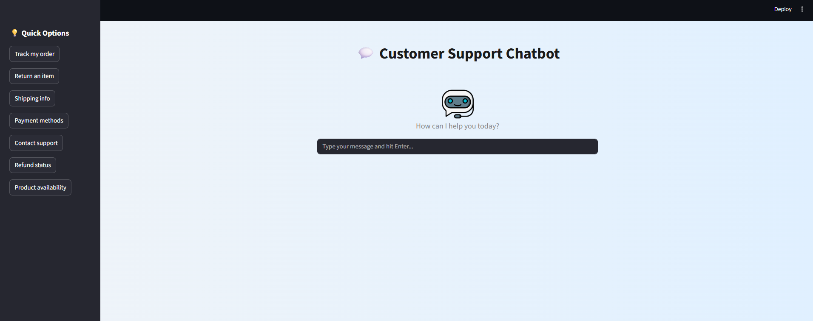
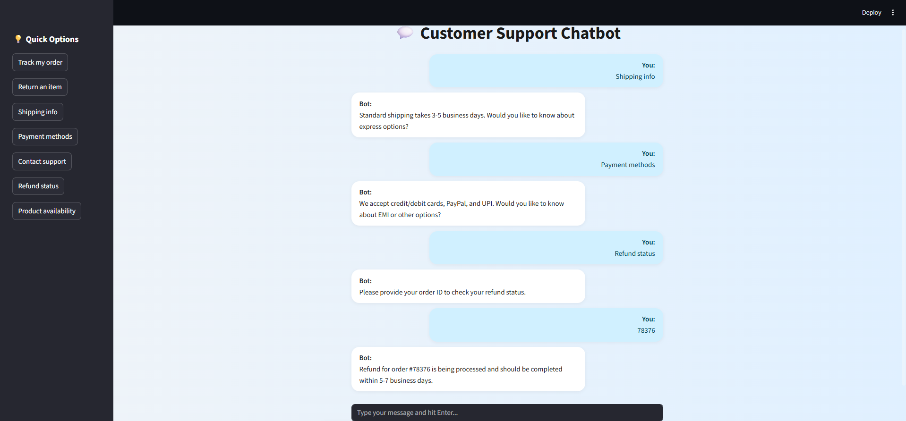

# 💬 Customer Support Chatbot (Streamlit + Dialogflow)

## 📝 Project Overview
This project is a modern, intelligent **customer support chatbot** built using **Streamlit** and **Dialogflow**. Designed to assist users with common service or e-commerce queries, it simulates a real-time chat experience — similar to platforms like Amazon, Flipkart, or Zomato.

The chatbot handles:
- FAQs
- Order tracking
- Returns and refunds
- Product availability
- Context-aware multi-turn conversations

All conversation logic (intents, slot filling, prompts, etc.) is managed in **Dialogflow**, making it scalable and easy to maintain.

The UI is styled like a **Telegram chat**, complete with avatars, chat bubbles, and a vertical quick-reply menu.

---

## 🚀 Key Features

- ✅ **Modern Chat UI**  
  Telegram-style bubbles, avatars, gradient background, and quick-reply buttons.

- 🔄 **Multi-Turn Conversations**  
  Context-aware logic, remembers previous inputs, fills in missing slots, and handles follow-ups.

- 🧠 **Dialogflow-Powered Intelligence**  
  Centralized intent and entity management. No need to update code for every new intent.

- ⚙️ **Customizable & Scalable**  
  Modify intents and training phrases in Dialogflow — the frontend remains untouched.

- 🧼 **Minimalist Design**  
  No blank inputs or clunky layouts. Just a clean, immersive chat experience.

---

## 💡 How to Use

1. **Launch the App**  
   Run the Streamlit app locally (`streamlit run app.py`). It will open in your browser.

2. **Start Chatting**  
   - Use the sidebar for quick-reply buttons like *"Track Order"* or *"Return Item"*.
   - Or, type your own message (e.g., _"Where is my order 498332?"_).

3. **Follow Bot Prompts**  
   - The bot may ask for details like order ID or reason for return.
   - Respond naturally — Dialogflow manages the follow-up logic.

4. **Enjoy the Experience**  
   The chat responds like a real agent, handling context, slots, and back-and-forth interactions.

---

## 📁 Folder Structure

customer-support-chatbot/
├── intents/                     
├── app.py                     
├── README.md                   
├── agent.json                  
└── package.json 

---

## 🌐 Preview

